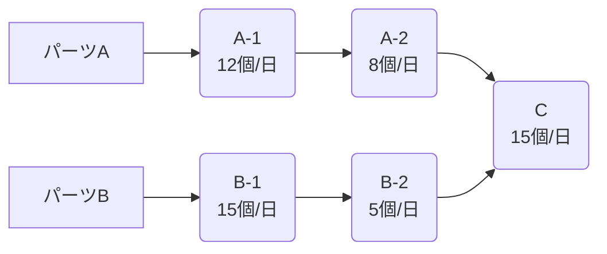
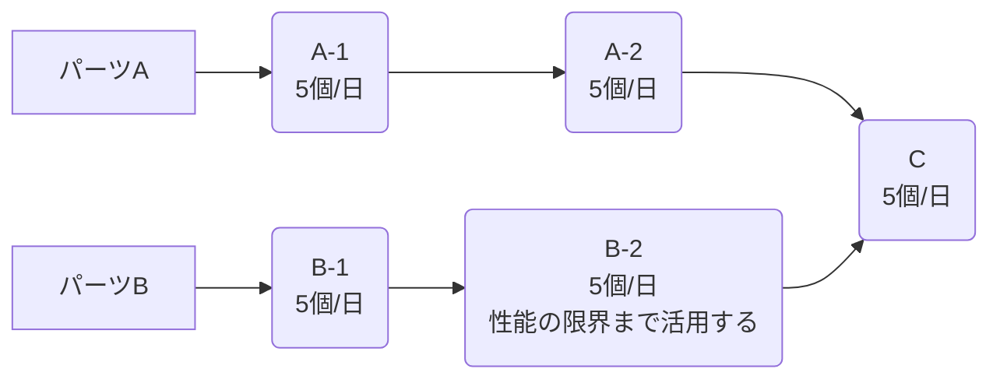
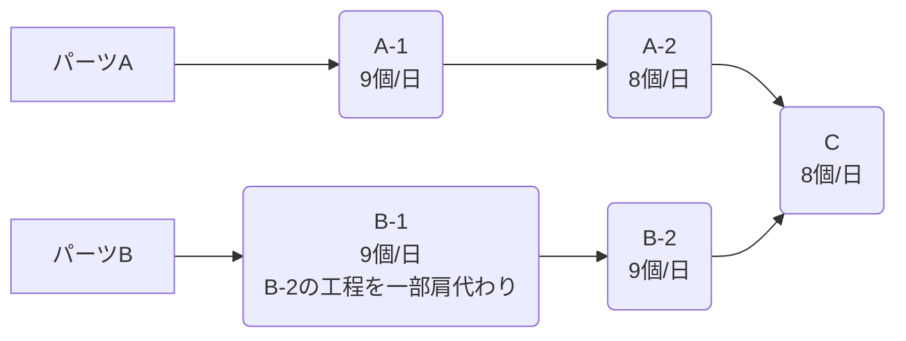

# 集中の５段階

## 概要 (Summary)
[[TOC]]で提案されている改善サイクル

## 詳細 (Details)
### 1. システムの制約条件を見つける
システムから全体のボトルネックを見つける。
次の例ならB-2が制約。

制約は「物理的制約条件」「市場の制約条件」「方針の制約条件」に分けることができる。
制約条件の殆どは「方針の制約条件」にあたる。
### 2. 制約条件を徹底活用する
ボトルネックになっている要素が持つパフォーマンスを最大限まで引き出す。
・制約条件に入る不良品を減らす
・今必要な分だけ作る
・間違った手順や方針を改める
・利益を最大限にする製品を作るなど

### 3. 制約条件以外の全てを制約条件に従属させる
他の要素が持っている能力をボトルネックまで制限する。
B-2を改善する前にCやA-2の生産能力を向上しても全体の生産性は向上しない。
個別最適を排除し全体最適を強制する。

### 4. 制約条件の能力を高める
ボトルネック箇所を他のステップに割り振るなどして制約条件の能力を高める

### 5. 制約条件が解消されたら惰性を避けて1に戻る
A-2が新たな制約条件になっていることを確認し、その改善に取り組む。

## 関連ノート (Related Notes)
- [[TOC]]

## 未解決の疑問/考察 (Open Questions/Thoughts)
(さらに知りたいこと、疑問点など)

## Geminiによる補足
(Geminiに質問した結果や要約などを記載)